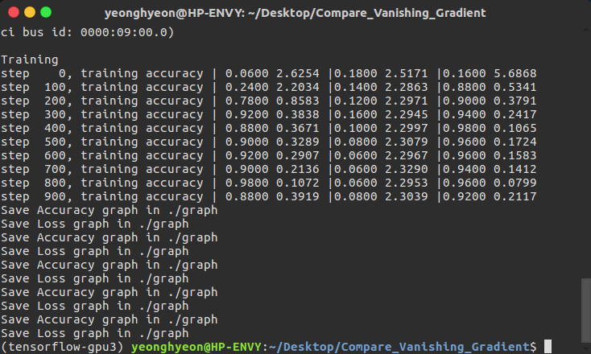
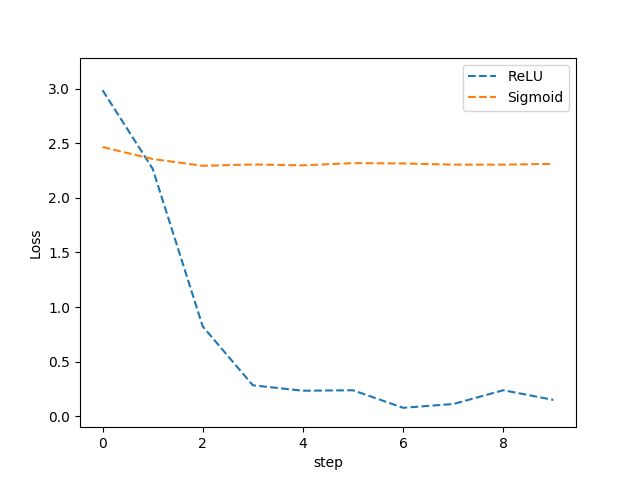
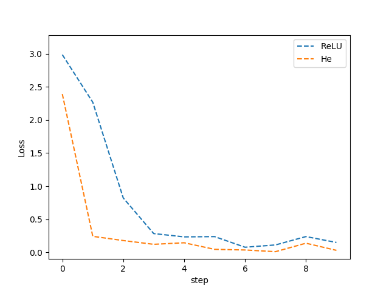

<h1>Compare_Vanishing_Gradient</h1>

 
The log of training process. 
Two from the left. ReLU, Sigmoid, ReLU with He initialization. 

 
The loss graph of ReLU and Sigmoid. 

 
The loss graph of ReLU with He initialization and without. 

